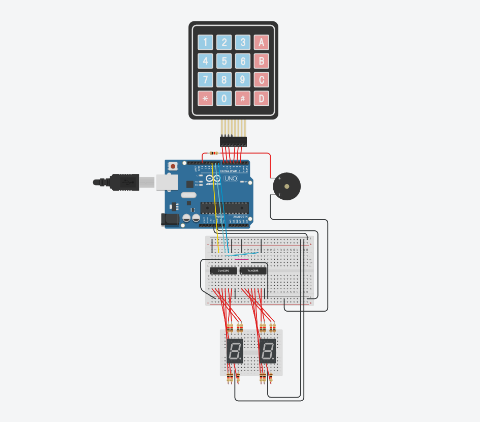
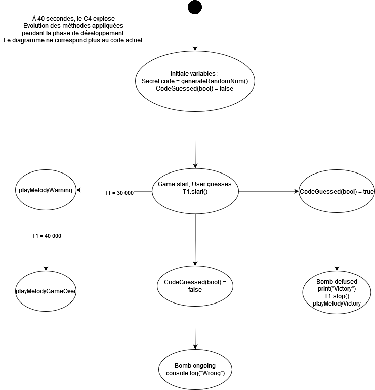

# C4

## Group

- Anatole THIEN
- Joan GLENDINNING

## Description

Le but du jeu est de trouver le code pour désamorcer la bombe avant la fin du temps imparti (40 secondes).

Le joueur peut choisir la difficulté du jeu en modifiant la variable `difficulty` dans le code source.

## Link

[www.tinkercad.com](https://www.tinkercad.com/things/dN3zUkhN4AD-tremendous-uusam-esboo/editel?sharecode=QOqoBTznJgF1yIuGt0trtLui_1SvFEPU_zBb0W8sQxc)

[github.com]()

## Schema

## Diagram

